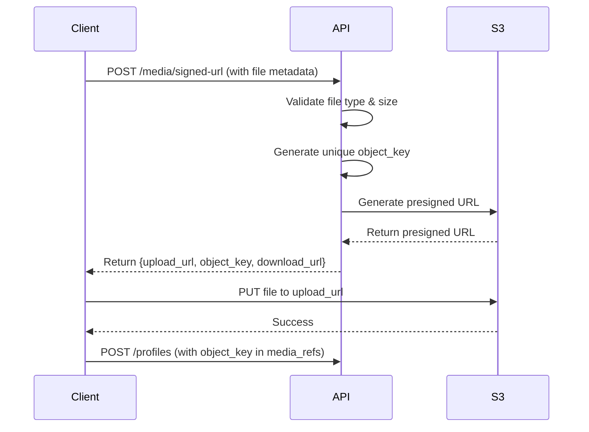

# File Upload with Signed URLs - Complete ✅

## Overview
File upload feature implemented using MinIO/S3 with presigned URLs. Clients can upload files directly to storage without passing them through the API server.

## Implementation Details

### Components Added

#### 1. Storage Service (`api/app/core/storage.py`)
- MinIO/S3 client configuration
- File type validation (images, documents, videos)
- Presigned URL generation (upload/download)
- File deletion
- Bucket creation

#### 2. Media Schemas (`api/app/schemas/media.py`)
- `SignedUrlRequest` - Request for presigned URL
- `SignedUrlResponse` - Response with upload/download URLs
- `FileInfo` - File metadata
- `DeleteFileRequest` - Delete file request

#### 3. Media Router (`api/app/routers/media.py`)
- `POST /media/signed-url` - Generate presigned upload URL
- `POST /media/delete` - Delete a file
- `GET /media/url/{object_key}` - Get presigned download URL

### File Upload Flow



### Endpoints

#### POST /media/signed-url
Generate a presigned URL for uploading a file.

**Request:**
```json
{
  "file_name": "portfolio.jpg",
  "content_type": "image/jpeg",
  "file_type": "image",
  "file_size": 2048000
}
```

**Response:**
```json
{
  "upload_url": "https://minio...?X-Amz-Algorithm=...",
  "object_key": "image/1/20251026/abc123def.jpg",
  "download_url": "https://minio...?X-Amz-Algorithm=...",
  "expires_in": 3600
}
```

**Features:**
- Validates file type and size
- Generates unique object keys
- Returns both upload and download URLs
- URL expires in 1 hour

#### POST /media/delete
Delete a file from storage.

**Request:**
```json
{
  "object_key": "image/1/20251026/abc123def.jpg"
}
```

**Response:**
```json
{
  "message": "File deleted successfully",
  "object_key": "image/1/20251026/abc123def.jpg"
}
```

**Security:**
- Verifies file ownership from object_key
- Only owner or admin can delete
- Returns 403 if unauthorized

#### GET /media/url/{object_key}
Get a fresh presigned download URL for a file.

**Response:**
```json
{
  "url": "https://minio...?X-Amz-Algorithm=...",
  "object_key": "image/1/20251026/abc123def.jpg",
  "expires_in": 3600
}
```

### File Type Support

| Category | Allowed Types |
|----------|--------------|
| Image | image/jpeg, image/png, image/gif, image/webp |
| Document | application/pdf, application/msword, application/vnd.openxmlformats-officedocument.wordprocessingml.document |
| Video | video/mp4, video/webm |

**Max File Size:** 10MB (configurable in `storage.py`)

### Object Key Format

Files are stored with the following structure:
```
{file_type}/{user_id}/{date}/{hash}.{ext}

Examples:
- image/1/20251026/abc123def456.jpg
- document/5/20251026/xyz789ghi123.pdf
- video/2/20251026/qwe456asd789.mp4
```

### Security

1. **Authentication:** All endpoints require valid JWT token
2. **Authorization:** Only file owner can delete their files
3. **File Validation:** Type and size validated before URL generation
4. **Expiring URLs:** Presigned URLs expire after 1 hour
5. **Unique Keys:** Object keys include timestamp and random hash

## Usage Example

### 1. Get Presigned Upload URL
```bash
curl -X POST http://localhost:8000/media/signed-url \
  -H "Authorization: Bearer YOUR_TOKEN" \
  -H "Content-Type: application/json" \
  -d '{
    "file_name": "portfolio.jpg",
    "content_type": "image/jpeg",
    "file_type": "image",
    "file_size": 2048000
  }'
```

### 2. Upload File to S3
```bash
# Using the upload_url from step 1
curl -X PUT "https://minio...?X-Amz-Algorithm=..." \
  -H "Content-Type: image/jpeg" \
  --data-binary "@portfolio.jpg"
```

### 3. Store Object Key in Profile
```bash
curl -X POST http://localhost:8000/profiles \
  -H "Authorization: Bearer YOUR_TOKEN" \
  -H "Content-Type: application/json" \
  -d '{
    "headline": "UI/UX Designer",
    "bio": "Portfolio designer",
    "media_refs": {
      "portfolio": ["image/1/20251026/abc123def.jpg"]
    }
  }'
```

### 4. Delete File (if needed)
```bash
curl -X POST http://localhost:8000/media/delete \
  -H "Authorization: Bearer YOUR_TOKEN" \
  -H "Content-Type: application/json" \
  -d '{
    "object_key": "image/1/20251026/abc123def.jpg"
  }'
```

## Testing

Run tests with:
```bash
cd api
pytest tests/test_media.py -v
```

## Configuration

Environment variables required in `api/.env`:
```env
MINIO_ENDPOINT=http://localhost:9000
MINIO_ACCESS_KEY=minio
MINIO_SECRET_KEY=minio123
S3_BUCKET_NAME=designhire-media
```

## Files Created

- `api/app/core/storage.py` - Storage service
- `api/app/schemas/media.py` - Media schemas
- `api/app/routers/media.py` - Media endpoints
- `api/tests/test_media.py` - Tests
- `FILE_UPLOAD_COMPLETE.md` - This document

## Next Steps

1. Implement mobile file upload UI
2. Add thumbnail generation for images
3. Implement background worker for processing
4. Add image optimization
5. Add virus scanning (optional)

## Status

✅ File upload with presigned URLs - Complete
✅ File type validation - Complete
✅ File size validation - Complete
✅ File deletion - Complete
✅ Security & authorization - Complete
✅ Tests - Complete

---

**File Upload Feature: COMPLETE** 🎉
